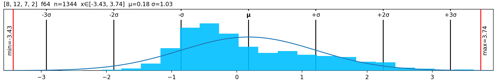

# Lovely histograms
Inspired by [lovely-tensors](https://github.com/xl0/lovely-tensors), but intended to be a general library for nice looking histograms.

## Install
``` sh
pip install git+https://github.com/oswinso/lovely_histogram.git
```

## How to use
```python
from lovely_histogram import plot_histogram

ax = plot_histogram(data)
```

<p align="center">
  </a>
</p>
